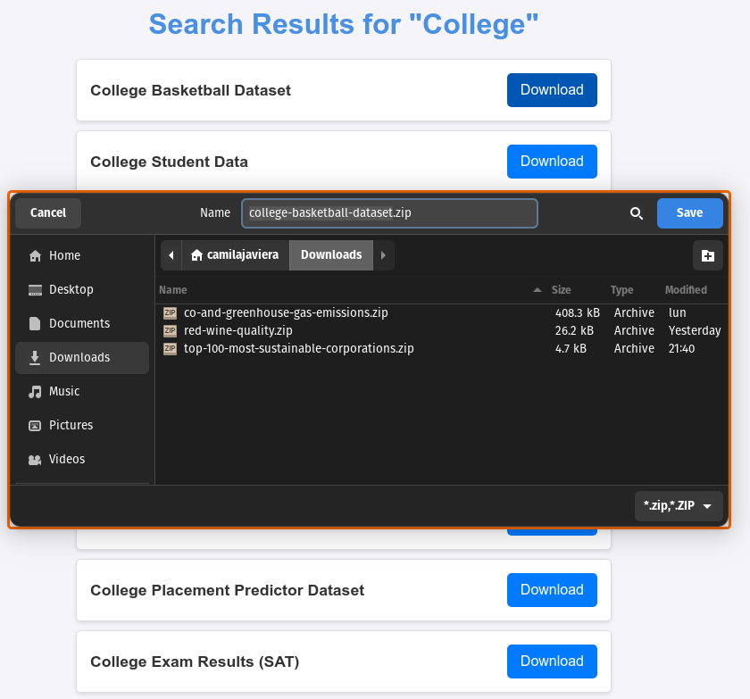

# Dataset Search and Download App:

This is a **Flask-based web application** that allows users to **search for datasets** on **Kaggle** and **download** them directly. 
<br>
The app provides a **user-friendly** interface to interact with Kaggle's dataset repository, making it easier to find and retrieve datasets.

## Features:

- **Search for Datasets:** Enter a `search` term to find **datasets** hosted on **Kaggle**.
- **View Search Results:** See a **list of datasets** that match your `query`, along with their titles.
- **Download Datasets:** Download selected **datasets** as `.zip` files directly from the application.

## Files in the Repository:

### Python Scripts:

1. **`App.py`:**
   - The main Flask application that handles routes and renders templates.
   - Routes:
     - `/`: Home page.
     - `/search`: Search for datasets.
     - `/download/<path:dataset_ref>`: Download the selected dataset.

2. **`kaggle_connect.py`:**
   - Handles interaction with the Kaggle API.
   - Functions:
     - `search_datasets(search_term)`: Searches Kaggle for datasets matching the provided term.
     - `download_dataset(dataset_ref)`: Downloads a dataset by its reference.

### HTML Templates:

1. **`index.html`:**
   - Home page with a welcome message and a link to the search page.

2. **`search.html`:**
   - A form to input a search term for finding datasets.

3. **`search_results.html`:**
   - Displays the search results and provides download links for each dataset.

## Prerequisites:

- Python 3.8+
- Kaggle API credentials (download your `kaggle.json` from Kaggle and place it in `~/.kaggle/` or the project root).

## Installation:

1. Clone the repository:
   ```bash
   git clone https://github.com/yourusername/dataset-search-download.git
   cd dataset-search-download
   ```

2. Install the required dependencies:
   ```bash
   pip install -r requirements.txt
   ```

3. Set up Kaggle API credentials:
   - Place your `kaggle.json` file in the `~/.kaggle/` directory or in the root of the project.

## Usage:

1. Run the Flask application:
   ```
   python App.py
   ```

2. Open your web browser and navigate to:
   ```
   http://127.0.0.1:5000/
   ```

3. Use the application to search for datasets, view results, and download datasets.

### This is how the application will look after using the code:

1. After accessing `http://127.0.0.1:5000/`, you should see a page like the one shown below, and click the **"Search for Datasets"** button.

2. Then, after selecting **"Search for Datasets"**. We enter the term we want to find. In this case, we are using the example **"College"**."

3. We will see a list of **Datasets** from which we will select one. In this case we are going to select the first dataset **"College Basketball Dataset"**.

4. The system will save the .zip file of the selected dataset into the **"Downloads folder"**.

5. After selecting the dataset we want, we can go back to the beginning to download another dataset.

6. Finally, it shows us the home page with a small message telling us the last .zip file we downloaded.


## Project Structure:

```
.
├── App.py                # Main Flask application
├── kaggle_connect.py     # Kaggle API integration
├── templates/            # HTML templates
│   ├── index.html
│   ├── search.html
│   ├── search_results.html
├── dataset/              # Directory for downloaded datasets
└── README.md             # Project documentation
```

## Notes:

- Ensure that the Kaggle API is properly authenticated to use this application.
- The downloaded datasets are saved in the `dataset/` directory as `.zip` files.

## Documentation:

- [Kaggle API Documentation](https://github.com/Kaggle/kaggle-api)
- [Flask Documentation](https://flask.palletsprojects.com/en/stable/)